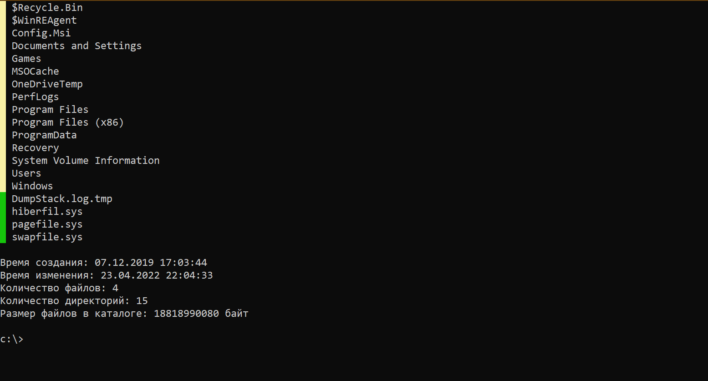

# Simple Console File Manager
## Оглавление.
1.[Краткое описание программы](#краткое-описание-программы)  
2.[Обзор функций](#обзор-функций)

  * [Список комманд](#список-команд)
  * [Создание дирректории](#создание-дирректории)
  * [Копирование, переименование, перемещение и удаление](#копирование-переименование-перемещение-и-удаление)
  * [Навигация](#навигация)
  * [Вывод информации](#вывод-информации)
  * [Запуск файла](#запуск-файла)
  * [Навигация по страницам](#навигация-по-страницам)

3.[Обзор исходного кода](#обзор-исходного-кода)
___
## Краткое описание программы.
Протой консольный файловый менеджер с следующими функциями:
* Копирование, перемещение, переименование, удаление файлов (дирректорий)
* Создание новый файлов (директорий)
* Запуск файлов
* Просмотр информации о файле (дирректории)

В программе реализован постраничный вывод списка файлов и дирректорий. Количество элементов на странице можно задать как в консоли с помощью команды `pagesize`, так и в конфигурационнм файле `config.xml`.
___
## Обзор функций.


При запуске программы вы увидете список файлов и дирректорий. Слева от названия имеется подсвеченный квадрат для того, чтобы пользователь визуально быстро отличал файлы от дирректорий. ***Желтым*** цветом обозначены дирректории, а ***зеленым*** - файлы.

Ниже отображена некоторая информации о дирректории, в которой вы сейчас находитесь.

Еще ниже представлена командная строка с отображением полоного пути к дирректории.

Список доступных команд можно посмотреть, введя команду `cdmlist`
___
### Список команд.
* cd - переход к следующей дирректоии
* back - возврат к предыдущей дирректории
* mkdir - создание дирректории
* delete - удаление файла (дирректории)
* copy - копирование файла (дирреткории)
* move - перемещение (переименование) файла или дирректории
* clear - очистка консоли
* pn - следующая страница
* pp - предыдущая страница
* p "x" - переход на "x" страницу
* exit - выход из программы
* info - информация о файле (дирреткории)
* pagesize - изменить количество элементов на странице
* start - запуск файла

### Создание дирректории.
Выполняется коммандой **mkdir**. После через кавычки указывается название.  
Пример: `mkdir "New Folder"`.

### Копирование, переименование, перемещение и удаление.
Выполняется командами **copy**(копирование), **move**(перемещение, переименование), **delete**(удаление). Далее через кавычки указывается название файла(дирректории) и новый путь. В случае удаления новый путь указывать не нужно. Например:

`copy "file.txt" "filecopy.txt"` - копирует файл в текущую дирректорию с перезаписью.  
`copy "file.txt" "c:\Users\file.txt"` - копирует файл в заданный путь.  
`move "file.txt" "newfile.txt"` - переименовывает файл.  
`move "folder" "newfolder"` - переименовывает дирректорию.  
`copy "folder" "c:\Users\folder"` - копирует файл в заданный путь.  
`delete "file.txt"` - удаление файла.

### Навигация
Переход по папкам осуществляется с помощью команд **cd** и **back**. Например:

`cd "Program Files"` - переход в папку *Program Files*.  
`cd "c:\"` - переход по заданному пути.

В случае команды *back* путь задавать не нужно, так как она выполняет функцию возврата в родительский каталог.

### Вывод информации
Выполняется командой **info**, после чего через кавычки указывается название файла(дирреткории).

### Запуск файла
Выполняется командой **start**, после чего через кавычки указывается название файла. Если вы вместо файла введете название дирректории, то откроется проводник.

### Навигация по страницам
Выполняется командами **pn** (следующая страница), **pp** - предыдущая страница. Номер текущей страницы отображается в информационном блоке ниже списка файлов и папок. Кроме того, там же и отображается и общее количество страниц.  
С помощью команды **pagesize** можно задать количество элементов через кавычки. Например: `pagesize "25"`.
___
## Обзор исходного кода
Выполнение программы начинается с проверки файла `config.xml` и последующей десереализации.
```c#
            SerializeClass serialize = new SerializeClass();
            int page = 1;

            if (File.Exists(serializeFileName))
            {
                try
                {
                    string xmlText = File.ReadAllText(serializeFileName);
                    StringReader reader = new StringReader(xmlText);
                    XmlSerializer xml = new XmlSerializer(typeof(SerializeClass));
                    serialize = (SerializeClass)xml.Deserialize(reader);
                    path = serialize.Path;
                    pageSize = serialize.PageSize;
                    page = serialize.Page;
                }
                catch (Exception ex)
                {
                    Console.WriteLine($"Произошла ошибка при десериализации: {ex.Message}\n" +
                        $"Для продолжения нажмите любую клавишу.");
                    File.AppendAllText(logFileName, $"{DateTime.Now} - {ex.Message} - Ошибка десериализации\n\n");
                    Console.ReadKey(true);
                }
            }
            else
            {
                serialize.Path = path;
                serialize.PageSize = pageSize;
                serialize.Page = page;
                Serialize(serialize);
            }
```
Далее выполняются ряд методов по выводу списка файлов и каталогов, информации на консоль
```c#
        static void Print(string path, int page)
        {
            try
            {
                Console.Clear();
                DirectoryInfo directoryInfo = new DirectoryInfo(path);
                dirs = Directory.GetDirectories(path);
                files = Directory.GetFiles(path);

                if (dirs.Length == 0 & files.Length == 0)
                {
                    Console.WriteLine("Пустая дирректория");
                }
                list = CombineArray(dirs, files);

                pages = Convert.ToInt32(Math.Round(((float)list.Length / pageSize), MidpointRounding.ToPositiveInfinity));
                if (page > pages)
                {
                    page = pages;
                }
                if (page <= 0)
                {
                    page = 1;
                }

                int skipFiles = pageSize * (page - 1);

                for (int i = skipFiles; i < skipFiles + pageSize; i++)
                {
                    if (list.Length <= i)
                    {
                        break;
                    }
                    if (i < dirs.Length)
                    {
                        Console.BackgroundColor = ConsoleColor.Yellow;
                    }
                    else
                    {
                        Console.BackgroundColor = ConsoleColor.Green;
                    }
                    Console.Write(" ");
                    Console.BackgroundColor = ConsoleColor.Black;
                    Console.Write($" {Path.GetFileName(list[i])}\n");
                }
                ListInfoFromPrint(page);

            }
            catch (Exception ex)
            {
                Console.WriteLine(ex.Message);
                File.AppendAllText(logFileName, $"{DateTime.Now} - {ex.GetType()} - {ex.Source} - {ex.Message} - PrintFilesMethod\n\n");
                DirectoryInfo directoryInfo = new DirectoryInfo(path);
                Program.path = directoryInfo?.Parent?.FullName;
            }
        }
```
Метод, выводящий информацию о текущей дирректории
```c#
        static void ListInfoFromPrint(int page)
        {
            DirectoryInfo info = new DirectoryInfo(path);
            Console.WriteLine();
            Console.WriteLine($"Страница: {page} из {pages}");
            Console.WriteLine($"Количество элементов на странице: {pageSize}");
            Console.WriteLine($"Время создания: {info.CreationTime}");
            Console.WriteLine($"Время изменения: {info.LastWriteTime}");
            Console.WriteLine($"Количество файлов: {files.Length}");
            Console.WriteLine($"Количество директорий: {dirs.Length}.");
            Console.WriteLine($"Размер файлов в каталоге: {ConvertSize(SizeAllFiles(info))}");
        }
```
Метод, который выводит текущий путь
```c#
        static void CommandLine(string path)
        {
            Console.Write($"\n{path}>");
        }
```
После вывода списка на консоль запускается цикл, в котором вводится команда с помощью `Console.ReadLine()` и производится проверка на наличие команды с помощью конструкции `switch`. Ниже приведен не полный фрагмент конструкци:
```c#
            while (true)
            {
                string input = Console.ReadLine();
                string command = StringMethods.RemoveAfterChar(input, ' ');
                string[] args = StringMethods.Split(input, '\"');

                try
                {
                    switch (command)
                    {
                        case "cd":
                            if (!IsEquals(args[1]))
                            {
                                Console.WriteLine("Файл или дирректория не найдены");
                                break;
                            }
                            page = 1;
                            path = Path.Combine(path, args[1]);
                            Print(path, page);
                            serialize.Path = path;
                            Serialize(serialize);
                            break;


                        case "back":
                            page = 1;
                            DirectoryInfo directoryInfo = new DirectoryInfo(path);
                            if (directoryInfo.Parent != null)
                            {
                                Program.path = directoryInfo.Parent.FullName;
                            }
                            Print(path, page);
                            serialize.Path = path;
                            Serialize(serialize);
                            break;
                            ...
```
Если имя команды совпадет со списком доступных команд, то сразу же в этой конструкции выполняются определенные действия, присущие конкретной команде. Также выполняется сериализация в командах **cd, back, pagesize, pn, pp, p**. После выполнения команды консоль либо очищается и снова выполняется метод `Print()`, либо не очищается. Очистка консоли уже встроена в метод `Print()`. Метод `ComandLine()` выполнится в любом случае, поскольку он находится в блоке `finally`.
```c#
                        ...
                        default:
                            Console.WriteLine($"Команда \"{command}\" не распознана.");
                            break;
                    }

                }
                catch (IndexOutOfRangeException ex)
                {
                    string text = "Команда введена неверно. Вводите путь через двойные ковычки";
                    Console.WriteLine(text);
                    File.AppendAllText(logFileName, $"{DateTime.Now} - {ex} - {text} - CommandMethod\n\n");
                }
                catch (Exception ex)
                {
                    Console.WriteLine($"Ошибка: {ex.Message}");
                    File.AppendAllText(logFileName, $"{DateTime.Now} - {ex.GetType()} - {ex.Source} - {ex.Message} - CommandMethod\n\n");
                }
                finally
                {
                    CommandLine(path);
                }
```
Чтобы обработать входящую строку из `Console.ReadLine()`, я создал отдельный класс `StringMethods`, в котором содержатся методы для преобразования строк. После ввода строки выполняются следующие методы:
```c#
                string command = StringMethods.RemoveAfterChar(input, ' ');
                string[] args = StringMethods.Split(input, '\"');
```
Метод `RemoveAfterChar` удаляет все символы, идущие после указанного в качестве аргумента. В данном случае это пробел. Метод `Split` возвращает массив строк по символу разделителю.

В файл `log.txt` сохраняется список возникших ошибок в процессе работы программы. Запись в файл реализовано в блоке `catch`.
```c#
                catch (Exception ex)
                {
                    Console.WriteLine($"Ошибка: {ex.Message}");
                    File.AppendAllText(logFileName, $"{DateTime.Now} - {ex.GetType()} - {ex.Source} - {ex.Message} - CommandMethod\n\n");
                }
```
Чтобы завершить программу нужно ввести команду `exit`, либо просто закрыть окно консоли. В коде это реализовано следующим образом:
```c#
                        case "exit":
                            return;
```
